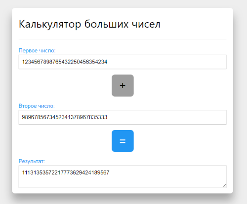

# 💪 Тестовое задание

## Задача #1

Сверстать адаптивно по [дизайну](example.png). 

По нажатию на тариф открывается окно подтверждения с таким же описанием тарифа, что и в карточке. При нажатии на затемненную область вне окна или на крестик, оно закрывается. Должно работать в последнем Google Chrome Browser, можно использовать es6. 

**Примечание:** не использовать готовые css фреймворки (bootstrap), Можно использовать jQuery/AngularJS, но желательно VanillaJS.

Результат - [fpestunov.github.io/skyeng-tesk-task](https://fpestunov.github.io/skyeng-tesk-task/)

## Задача #2 (Extra task)

Дано два положительных целых числа в виде строки. Числа могут быть очень большими, могут не поместиться в 64 битный integer. Написать функцию которая вернет сумму этих чисел. Использование exec не допускается.

**Примечание:** Используйте для решения PHP или JavaScript. У вас нет доступа к библиотекам для работы с большими числами.

Решение: [github.com/fpestunov/skyeng-tesk-task](https://github.com/fpestunov/skyeng-tesk-task).

Описание файлов:
- `index.php` - главная страница (C - контроллер);
- `layout.php` - шаблонизатор (V - представление);
- `functions.php` - функции (M - модель).

### Как запустить код у себя?
1. Склонируйте или загрузите этот репозиторий
2. У себя в терминале в папке проекта выполните команду `php -S localhost:8000` и перейдите по адресу [http://localhost:8000/index.php](http://localhost:8000/index.php)